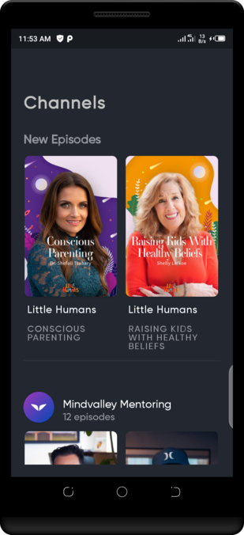

## Growth 

Growth is a beautiful tool for self improvement in one's capacity and realizing one's goals. As a
mobile app, all it takes is a single tap from the phone

## App at a glance (Click app photo below for video)

- Splash Screen
- Home Page content
- Offline Capability

## Features

- Implements the Mindvalley App Design
- Developed with Kotlin and Android sdk, supports API 19 and above
- Model-View-ViewModel (MVVM) Architecture
- Api calls using Retrofit
- Image loaded and cached with Glide
- ROOM for local Database
- Pull to Refresh
- Shimmer effect for loading progress
- Splash screen with mindvalley app icon and text animation
- Built to support all screen sizes including tablets
- Includes Unit and UI tests

## Challenging

- Figuring out the best approach for the UI to make it flexible and scalable took some brainstorming
  but i figured a modularized layout approach would fit it perfectly and that is what i used, also
  writing unit tests for some thread based components due to few resources but i used the examples
  from my research from the Google's android team i also wrote other unit tests (converters for
  database) and UI tests

## Features Suggestions

- Share course, course progress and/or completion online
- Go live with mentors (an exclusive or group meet up online)
- Recommendation and review
- More sleek designs like the home page
